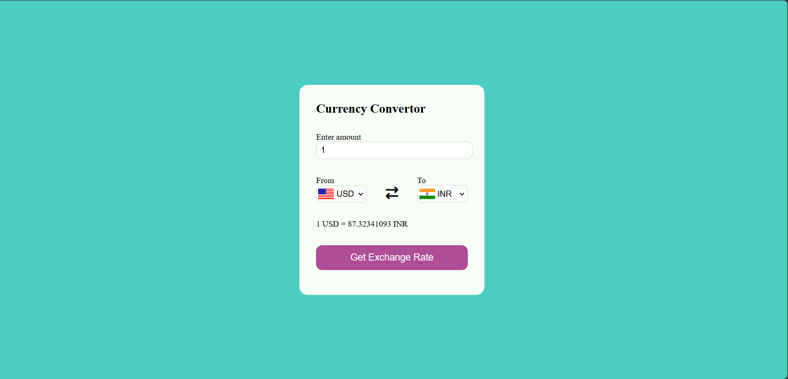

# 💱 Currency Converter

A responsive web app to convert currencies in real-time using [Fawaz Ahmed's Currency API](https://github.com/fawazahmed0/currency-api). Built with HTML, CSS, and JavaScript.

## 🌐 Live Preview



## 🚀 Features

- Convert between 100+ currencies
- Auto-updated exchange rates
- Country flags for selected currencies
- Responsive design for desktop and mobile

## 🛠️ Tech Stack

- HTML5
- CSS3
- JavaScript (Vanilla)
- [Font Awesome](https://fontawesome.com/)
- [Flags API](https://flagsapi.com/)
- [Currency API](https://github.com/fawazahmed0/currency-api)

## 📁 Project Structure

```plaintext
CURRENCY CONVERTOR/
├── index.html         # Main HTML file
├── style.css          # Styling
├── app.js             # API logic and DOM interaction
├── code.js            # Currency-country mapping
├── preview.png        # Screenshot for README
```

## 📦 Setup Instructions

1. Clone the repository  
   `git clone https://github.com/anushkachandra933/Currency-Converter-Project.git`

2. Open `index.html` in your browser  
   *(No build tools or server required)*


    ## 🖥️ How It Works

- Select currencies from dropdowns
- Enter amount to convert
- Click "Get Exchange Rate" to see results


## ✅ To-Do

- [ ] Add error handling for failed API requests
- [ ] Add loading spinner during fetch
- [ ] Add currency search/filter


## 👩‍💻 Author

Made with ❤️ by [Anushka Chandra](https://github.com/anushkachandra933)
